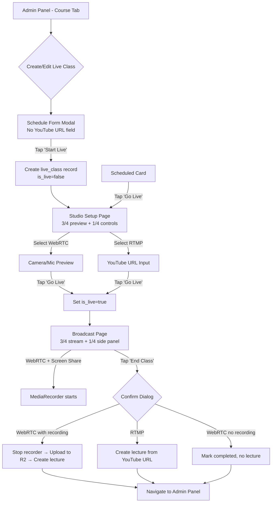
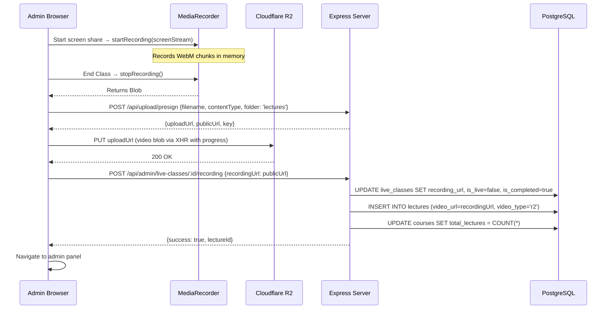

# Design Document: Professional Live Class Studio

## Overview

This design replaces the current YouTube-URL-centric live class system with a professional Studio experience. The current system requires admins to paste a YouTube URL at scheduling time. The new system defers stream configuration to a dedicated Studio Setup page, adds browser-native WebRTC streaming with auto-recording, and provides a full-screen Broadcast page with integrated chat and student monitoring.

The architecture follows the existing patterns: React Native Web (Expo) frontend, Express + PostgreSQL (Neon) backend, Cloudflare R2 for storage, React Query for data fetching, and polling-based real-time updates.

### Key Design Decisions

1. **WebRTC is browser-only, not peer-to-peer**: The admin streams from their browser using `getUserMedia` / `getDisplayMedia`. Students watch via a simple video element or YouTube embed — there is no WebRTC peer connection to students. The admin's stream is recorded locally via `MediaRecorder` and uploaded to R2 after the session.
2. **No media server**: WebRTC mode means the admin broadcasts their camera/screen to themselves (preview) and records it. Students join the "live class" but only see the stream after it's uploaded as a recording, OR the admin uses RTMP/YouTube for real-time student viewing. This matches the requirements — WebRTC is for recording, not live distribution.
3. **RTMP mode preserves existing YouTube embed**: When RTMP is selected, the existing YouTube embed viewer is reused on the Broadcast page.
4. **Incremental schema migration**: New columns are added via `ALTER TABLE ... ADD COLUMN IF NOT EXISTS` at server startup, matching the existing pattern.
5. **Reuse existing upload infrastructure**: Recording uploads use the existing `uploadToR2` utility with presigned URLs for large video files.

### Flow Diagram



## Architecture

### System Architecture

```mermaid
graph TB
    subgraph Frontend [React Native Web - Expo]
        SF[Schedule Form Modal]
        SS[Studio Setup Page<br/>/admin/studio/[id]]
        BP[Broadcast Page<br/>/admin/broadcast/[id]]
        CP[Chat Panel Component]
        SP[Students Panel Component]
        WR[WebRTC Manager Hook]
        MR[MediaRecorder Hook]
    end
    
    subgraph Backend [Express Server]
        API[REST API Endpoints]
        DB[(PostgreSQL - Neon)]
    end
    
    subgraph Storage [Cloudflare R2]
        R2[Recording Files]
    end
    
    SF -->|POST /api/admin/live-classes| API
    SS -->|GET /api/live-classes/:id| API
    BP -->|PUT /api/admin/live-classes/:id| API
    BP -->|GET/POST /api/live-classes/:id/chat| API
    CP -->|Poll every 3s| API
    SP -->|Poll every 10s| API
    MR -->|Upload via presigned URL| R2
    API --> DB
```

### Navigation Flow

New routes added to the Expo Router:
- `app/admin/studio/[id].tsx` — Studio Setup page
- `app/admin/broadcast/[id].tsx` — Broadcast page

Both are admin-only pages. The existing `app/live-class/[id].tsx` (student view) remains unchanged.

## Components and Interfaces

### Frontend Components

#### 1. Schedule Form (Modified)
- **Location**: `app/admin/index.tsx` (existing modal, modified)
- **Changes**: Remove `liveYoutubeUrl` field, add `chatMode` selector (Public/Private), add `showViewerCount` toggle. The "Start Live" / "Schedule" button creates the record and navigates to Studio.

#### 2. Studio Setup Page
- **Location**: `app/admin/studio/[id].tsx` (new)
- **Layout**: Full-screen, 3/4 preview + 1/4 control panel
- **Props**: `id` from route params (live class ID)
- **Responsibilities**:
  - Fetch live class data
  - Render stream source selector (WebRTC / RTMP)
  - WebRTC: show camera preview, device selectors
  - RTMP: show YouTube URL input
  - "Go Live" button → sets `is_live=true`, navigates to Broadcast

#### 3. Broadcast Page
- **Location**: `app/admin/broadcast/[id].tsx` (new)
- **Layout**: Full-screen, 3/4 stream + 1/4 side panel
- **Props**: `id` from route params, `streamType` from live class data
- **Responsibilities**:
  - WebRTC mode: display camera feed, cam/mic/screen-share controls, auto-record on screen share
  - RTMP mode: embed YouTube player
  - Side panel with Chat and Students tabs
  - "End Class" button with confirmation

#### 4. Chat Panel Component
- **Location**: `components/LiveChatPanel.tsx` (new, extracted)
- **Reuses**: Existing chat API (`/api/live-classes/:id/chat`)
- **Features**: Message list, send input, admin delete, hand-raise indicator, voice-to-text button (web only)

#### 5. Students Panel Component
- **Location**: `components/LiveStudentsPanel.tsx` (new)
- **Features**: List of watching students, viewer count display
- **Data**: Polls `/api/live-classes/:id/viewers` every 10 seconds

### Custom Hooks

#### `useWebRTCStream`
```typescript
interface UseWebRTCStreamReturn {
  stream: MediaStream | null;
  isVideoEnabled: boolean;
  isAudioEnabled: boolean;
  devices: { cameras: MediaDeviceInfo[]; microphones: MediaDeviceInfo[] };
  selectedCamera: string;
  selectedMicrophone: string;
  setSelectedCamera: (deviceId: string) => void;
  setSelectedMicrophone: (deviceId: string) => void;
  toggleVideo: () => void;
  toggleAudio: () => void;
  startScreenShare: () => Promise<MediaStream>;
  stopScreenShare: () => void;
  isScreenSharing: boolean;
  screenStream: MediaStream | null;
  error: string | null;
  cleanup: () => void;
}
```

#### `useMediaRecorder`
```typescript
interface UseMediaRecorderReturn {
  isRecording: boolean;
  startRecording: (stream: MediaStream) => void;
  stopRecording: () => Promise<Blob>;
  error: string | null;
}
```

### Backend API Changes

#### Modified Endpoints

**POST `/api/admin/live-classes`** — Add new fields:
```typescript
// New fields in request body
{
  streamType?: 'webrtc' | 'rtmp';  // default: 'rtmp'
  chatMode?: 'public' | 'private'; // default: 'public'
  showViewerCount?: boolean;        // default: true
  // youtubeUrl removed from creation — set later in Studio
}
```

**PUT `/api/admin/live-classes/:id`** — Add new fields:
```typescript
// Additional fields
{
  streamType?: 'webrtc' | 'rtmp';
  chatMode?: 'public' | 'private';
  showViewerCount?: boolean;
  recordingUrl?: string;  // set after R2 upload
}
```

#### New Endpoints

**POST `/api/live-classes/:id/viewers/heartbeat`** — Student presence heartbeat
```typescript
// Request: requires auth
// Body: {} (empty)
// Response: { success: true }
// Side effect: upserts into live_class_viewers table
```

**GET `/api/live-classes/:id/viewers`** — Get current viewers
```typescript
// Response: { viewers: [{ userId, userName }], count: number }
// Returns viewers with heartbeat within last 30 seconds
```

**POST `/api/live-classes/:id/raise-hand`** — Raise hand (student)
```typescript
// Request: requires auth
// Response: { success: true }
```

**DELETE `/api/live-classes/:id/raise-hand`** — Lower hand (student)
```typescript
// Request: requires auth
// Response: { success: true }
```

**GET `/api/admin/live-classes/:id/raised-hands`** — Get raised hands (admin)
```typescript
// Response: [{ id, userId, userName, raisedAt }]
```

**POST `/api/admin/live-classes/:id/raised-hands/:userId/resolve`** — Dismiss hand (admin)
```typescript
// Response: { success: true }
```

**POST `/api/admin/live-classes/:id/recording`** — Save recording URL and create lecture
```typescript
// Request body: { recordingUrl: string, sectionTitle?: string }
// Side effects:
//   1. Set recording_url on live_class
//   2. Set is_completed = true, is_live = false
//   3. Create lecture record with video_url = recordingUrl, video_type = 'r2'
//   4. Update course total_lectures count
// Response: { success: true, lectureId: number }
```


## Data Models

### Database Schema Changes

All changes use `ALTER TABLE ... ADD COLUMN IF NOT EXISTS` at server startup, matching the existing migration pattern in `server/routes.ts`.

#### `live_classes` table — New columns

| Column | Type | Default | Description |
|--------|------|---------|-------------|
| `stream_type` | TEXT | `'rtmp'` | `'webrtc'` or `'rtmp'` |
| `chat_mode` | TEXT | `'public'` | `'public'` or `'private'` |
| `recording_url` | TEXT | NULL | R2 URL of WebRTC recording |
| `show_viewer_count` | BOOLEAN | TRUE | Whether to show viewer count to students |

#### New table: `live_class_viewers`

```sql
CREATE TABLE IF NOT EXISTS live_class_viewers (
  id SERIAL PRIMARY KEY,
  live_class_id INTEGER NOT NULL,
  user_id INTEGER NOT NULL,
  user_name TEXT NOT NULL,
  last_heartbeat BIGINT NOT NULL,
  UNIQUE(live_class_id, user_id)
);
```

This table tracks student presence via heartbeats. Rows with `last_heartbeat` older than 30 seconds are considered stale and excluded from viewer queries.

#### New table: `live_class_hand_raises`

```sql
CREATE TABLE IF NOT EXISTS live_class_hand_raises (
  id SERIAL PRIMARY KEY,
  live_class_id INTEGER NOT NULL,
  user_id INTEGER NOT NULL,
  user_name TEXT NOT NULL,
  raised_at BIGINT NOT NULL,
  UNIQUE(live_class_id, user_id)
);
```

#### Drizzle Schema Updates (`shared/schema.ts`)

```typescript
// Updated liveClasses table
export const liveClasses = pgTable("live_classes", {
  // ... existing fields ...
  streamType: text("stream_type").default("rtmp"),
  chatMode: text("chat_mode").default("public"),
  recordingUrl: text("recording_url"),
  showViewerCount: boolean("show_viewer_count").default(true),
});

// New tables
export const liveClassViewers = pgTable("live_class_viewers", {
  id: serial("id").primaryKey(),
  liveClassId: integer("live_class_id").notNull(),
  userId: integer("user_id").notNull(),
  userName: text("user_name").notNull(),
  lastHeartbeat: bigint("last_heartbeat", { mode: "number" }).notNull(),
});

export const liveClassHandRaises = pgTable("live_class_hand_raises", {
  id: serial("id").primaryKey(),
  liveClassId: integer("live_class_id").notNull(),
  userId: integer("user_id").notNull(),
  userName: text("user_name").notNull(),
  raisedAt: bigint("raised_at", { mode: "number" }).notNull(),
});
```

### TypeScript Interfaces

```typescript
// Studio stream configuration
interface StudioConfig {
  streamType: 'webrtc' | 'rtmp';
  youtubeUrl?: string;       // only for RTMP
  chatMode: 'public' | 'private';
  showViewerCount: boolean;
  selectedCamera?: string;   // deviceId for WebRTC
  selectedMicrophone?: string; // deviceId for WebRTC
}

// Live class record (extended)
interface LiveClass {
  id: number;
  title: string;
  description?: string;
  courseId?: number;
  youtubeUrl?: string;
  scheduledAt?: number;
  isLive: boolean;
  isCompleted: boolean;
  isPublic: boolean;
  streamType: 'webrtc' | 'rtmp';
  chatMode: 'public' | 'private';
  recordingUrl?: string;
  showViewerCount: boolean;
  createdAt: number;
}

// Viewer presence
interface LiveViewer {
  userId: number;
  userName: string;
}

// Hand raise
interface HandRaise {
  id: number;
  liveClassId: number;
  userId: number;
  userName: string;
  raisedAt: number;
}
```

### Recording Upload Flow




## Correctness Properties

*A property is a characteristic or behavior that should hold true across all valid executions of a system — essentially, a formal statement about what the system should do. Properties serve as the bridge between human-readable specifications and machine-verifiable correctness guarantees.*

### Property 1: YouTube URL format acceptance

*For any* YouTube URL in a standard format (`https://youtube.com/live/VIDEO_ID`, `https://youtu.be/VIDEO_ID`, `https://youtube.com/watch?v=VIDEO_ID`, `https://www.youtube.com/embed/VIDEO_ID`), the URL validation function SHALL accept it as valid and extract a non-empty video ID.

**Validates: Requirements 5.4**

### Property 2: Chat mode message filtering

*For any* set of chat messages from multiple users, any viewer (student or admin), and any chat mode (public or private): when the chat mode is `public`, the filtered message list SHALL contain all messages; when the chat mode is `private`, the filtered message list SHALL contain only messages sent by the admin and messages sent by the viewing student themselves.

**Validates: Requirements 9.3, 9.4**

### Property 3: Recording completion creates lecture and updates state

*For any* valid live class with a course association and any valid R2 recording URL, when the recording endpoint is called, the system SHALL: (a) create a lecture record with the recording URL as `video_url` and `video_type = 'r2'`, (b) set `is_completed = true` and `is_live = false` on the live class, and (c) update the course's `total_lectures` count to match the actual number of lectures.

**Validates: Requirements 12.4, 12.5, 12.7**

## Error Handling

### WebRTC Errors

| Error Scenario | Handling |
|---|---|
| Camera/mic permission denied | Display descriptive error with instructions to grant permissions in browser settings. Disable "Go Live" button until permissions granted. |
| Device not found (camera/mic disconnected) | Show warning, fall back to remaining devices. If no devices available, show error. |
| `getUserMedia` not supported | Show error: "Your browser does not support camera access. Please use Chrome, Firefox, or Edge." |
| `getDisplayMedia` not supported | Hide screen share button. Show tooltip explaining browser requirement. |
| Screen share cancelled by user | No error — silently return to camera-only mode. |
| MediaRecorder not supported | Show warning that auto-recording is unavailable. Allow broadcast without recording. |

### Recording & Upload Errors

| Error Scenario | Handling |
|---|---|
| MediaRecorder fails during recording | Show error toast. Attempt to salvage partial recording from collected chunks. |
| Presign URL request fails | Retry up to 3 times with exponential backoff. Show error if all retries fail. |
| R2 upload fails (network error) | Show error with retry button. Keep the recording blob in memory for retry. Do NOT mark class as completed. |
| R2 upload fails (CORS) | Show specific CORS error message with instructions for R2 bucket configuration. |
| Recording endpoint fails after upload | Show error. The recording exists in R2 but lecture wasn't created. Provide manual retry option. |

### API Errors

| Error Scenario | Handling |
|---|---|
| Live class not found (404) | Navigate back to admin panel with error toast. |
| Unauthorized (401/403) | Redirect to login. |
| Network timeout on "Go Live" | Show error, re-enable button for retry. Do NOT navigate to Broadcast. |
| Network timeout on "End Class" | Show error, keep Broadcast page open. Allow retry. |
| Chat message send fails | Show inline error on the message. Allow retry. |
| Viewer heartbeat fails | Silently retry. Student experience unaffected. |

### Edge Cases

- **Browser tab closed during recording**: Recording is lost. No server-side fallback since recording is client-side only.
- **Multiple admin tabs**: Only one Studio/Broadcast session should be active. The system does not enforce this — last "Go Live" wins.
- **Slow upload on large recordings**: Show progress bar with percentage. Allow admin to wait or cancel (with warning about losing recording).

## Testing Strategy

### Unit Tests (Example-Based)

Focus on specific scenarios and edge cases:

1. **Schedule Form**: Verify form renders correct fields, no YouTube URL field, pre-fills on edit
2. **Studio Setup**: Verify layout, stream source switching, device enumeration display
3. **Broadcast Page**: Verify layout for WebRTC and RTMP modes, control toggles
4. **Chat Panel**: Verify message rendering, admin badge, delete functionality
5. **Students Panel**: Verify viewer list rendering, count display toggle
6. **useWebRTCStream hook**: Test device selection, toggle video/audio, screen share start/stop
7. **useMediaRecorder hook**: Test start/stop recording, blob output
8. **End Class flow**: Test confirmation dialog, different end scenarios (WebRTC with/without recording, RTMP)
9. **Error states**: Permission denied, upload failure, network errors

### Property-Based Tests

Using a property-based testing library (e.g., `fast-check`):

- **Property 1**: Generate YouTube URLs in various valid formats, verify `getYouTubeVideoId` extracts a valid 11-character ID. Minimum 100 iterations.
  - Tag: `Feature: professional-live-class-studio, Property 1: YouTube URL format acceptance`
- **Property 2**: Generate random message sets with random user IDs and admin flags, test the chat filtering function for both public and private modes. Minimum 100 iterations.
  - Tag: `Feature: professional-live-class-studio, Property 2: Chat mode message filtering`
- **Property 3**: Generate random live class records with course IDs and random R2 URLs, call the recording completion logic, verify lecture creation, state updates, and lecture count. Minimum 100 iterations.
  - Tag: `Feature: professional-live-class-studio, Property 3: Recording completion creates lecture and updates state`

### Integration Tests

1. **Full "Go Live" flow**: Create class → Studio → Go Live → verify `is_live=true` in DB
2. **End Class with recording**: End class → verify recording URL saved, lecture created, `is_completed=true`
3. **Chat polling**: Send messages → verify they appear within polling interval
4. **Viewer heartbeat**: Send heartbeats → verify viewer list updates
5. **Hand raise flow**: Raise → verify in admin list → dismiss → verify removed

### Smoke Tests

1. **Database migrations**: Verify all new columns exist after server startup
2. **MediaRecorder format**: Verify `video/webm` is supported by the browser's MediaRecorder
