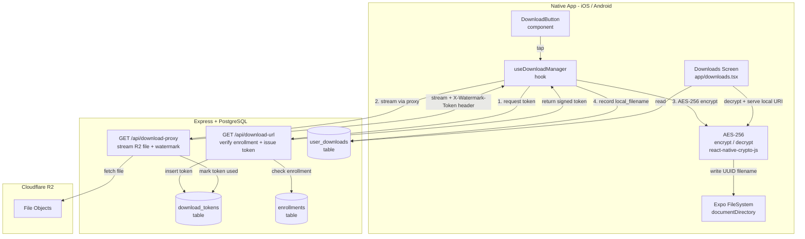
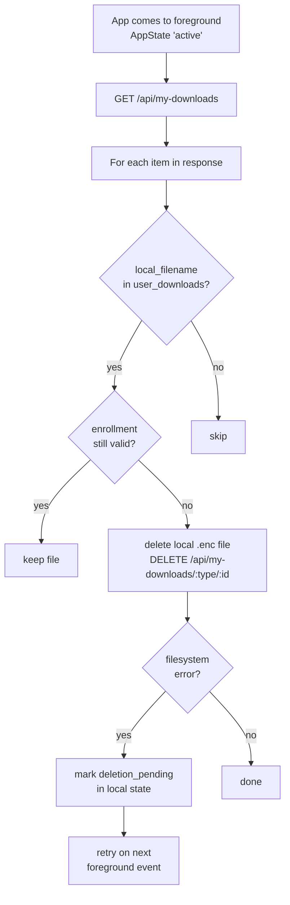

# Design Document: Secure Offline Downloads

## Overview

This feature adds encrypted offline download capability for course lectures (videos) and study materials (PDFs) on native iOS and Android only. Files are downloaded through a backend proxy (never directly from R2), encrypted with AES-256 at rest, stored under UUID-obfuscated filenames in the app's private `documentDirectory`, and automatically deleted when access is revoked.

The design extends existing infrastructure:
- `user_downloads` table — adds `local_filename` column
- `enrollments` table — adds `valid_until` column
- `/api/my-downloads` GET/POST — extended, not replaced
- `app/downloads.tsx` — extended, not replaced

Web users are excluded from all download functionality (`Platform.OS === 'web'` guard at every entry point).

---

## Architecture



### Key Design Decisions

- **Backend proxy only**: The client never receives a direct R2 URL. The `download-url` endpoint returns a short-lived opaque token; the `download-proxy` endpoint streams the actual bytes. This keeps R2 credentials server-side and enables watermarking.
- **Single-use 30-second tokens**: Stored in a `download_tokens` DB table. Marked `used = true` before streaming begins, preventing replay attacks.
- **AES-256 with `react-native-crypto-js`**: Chosen over `expo-crypto` because `expo-crypto` only provides hashing/random bytes, not symmetric encryption. The encryption key is derived from the user's session token + device ID using PBKDF2 and stored in Expo SecureStore (Keychain/Keystore), never on the filesystem.
- **UUID filenames**: `expo-crypto.randomUUID()` generates the on-disk filename. The mapping from UUID → item is stored only in `user_downloads.local_filename`.
- **Foreground check**: `AppState` listener triggers an access-validity check on every foreground transition before the Downloads screen renders, ensuring revoked content is purged promptly.
- **FLAG_SECURE / iOS equivalent**: Applied via `react-native-flag-secure` (Android) and `expo-screen-capture` (iOS) when the local video player is active.

---

## Components and Interfaces

### DownloadButton Component

```typescript
// components/DownloadButton.tsx
interface DownloadButtonProps {
  itemType: 'lecture' | 'material';
  itemId: number;
  downloadAllowed: boolean;
  isEnrolled: boolean;
}
```

Rendering rules (all must be true to show the button):
1. `Platform.OS !== 'web'`
2. `downloadAllowed === true`
3. `isEnrolled === true`

States rendered:
- **idle**: download icon
- **downloading**: circular progress indicator with percentage
- **downloaded**: green checkmark + "Downloaded" label
- **error**: red alert icon, tap to retry

### useDownloadManager Hook

```typescript
// hooks/useDownloadManager.ts
interface DownloadState {
  status: 'idle' | 'downloading' | 'downloaded' | 'error' | 'deletion_pending';
  progress: number;          // 0–100
  localFilename?: string;    // UUID on disk
  error?: string;
}

interface UseDownloadManagerReturn {
  getDownloadState: (itemType: string, itemId: number) => DownloadState;
  startDownload: (itemType: 'lecture' | 'material', itemId: number) => Promise<void>;
  deleteDownload: (itemType: string, itemId: number) => Promise<void>;
  getLocalUri: (itemType: string, itemId: number) => Promise<string | null>;
  getTotalStorageBytes: () => Promise<number>;
  runForegroundAccessCheck: () => Promise<void>;
}
```

Internal state is a `Map<string, DownloadState>` keyed by `"${itemType}:${itemId}"`, persisted to AsyncStorage for cross-session continuity.

### EncryptionService

```typescript
// lib/encryptionService.ts
interface EncryptionService {
  getOrCreateKey(): Promise<string>;          // PBKDF2 key from SecureStore
  encryptBuffer(data: ArrayBuffer): Promise<string>;   // returns base64 ciphertext
  decryptToUri(ciphertext: string, destPath: string): Promise<string>; // writes plaintext, returns file:// URI
}
```

Key derivation: `PBKDF2(sessionToken + deviceId, salt, 100000 iterations, 256 bits)`. Salt is stored alongside the key in Expo SecureStore. On key rotation (re-login), all downloads are invalidated and re-download is required.

---

## Data Models

### New Table: `download_tokens`

```sql
CREATE TABLE download_tokens (
  id          SERIAL PRIMARY KEY,
  token       TEXT NOT NULL UNIQUE,          -- opaque UUID token
  user_id     INTEGER NOT NULL REFERENCES users(id) ON DELETE CASCADE,
  item_type   TEXT NOT NULL CHECK (item_type IN ('lecture', 'material')),
  item_id     INTEGER NOT NULL,
  r2_key      TEXT NOT NULL,                 -- resolved R2 object key
  used        BOOLEAN NOT NULL DEFAULT FALSE,
  created_at  BIGINT NOT NULL DEFAULT EXTRACT(EPOCH FROM NOW()) * 1000,
  expires_at  BIGINT NOT NULL               -- created_at + 30000 ms
);

CREATE INDEX idx_download_tokens_token ON download_tokens(token);
CREATE INDEX idx_download_tokens_expires ON download_tokens(expires_at);
```

Expired tokens are cleaned up by a periodic job (every 5 minutes, delete where `expires_at < now AND used = TRUE`).

### Modified Table: `user_downloads`

Add column:

```sql
ALTER TABLE user_downloads
  ADD COLUMN local_filename TEXT;           -- UUID-based filename on device disk
```

The `local_filename` is set when the download completes on the client and is sent to the server via `POST /api/my-downloads`. It is `NULL` for legacy records or items not yet downloaded to the current device.

### Modified Table: `enrollments`

Add column:

```sql
ALTER TABLE enrollments
  ADD COLUMN valid_until BIGINT;            -- epoch ms, NULL = no expiry
```

### Schema Summary

```
user_downloads
  id, user_id, item_type, item_id, downloaded_at,
  local_filename (NEW)

download_tokens (NEW)
  id, token, user_id, item_type, item_id, r2_key,
  used, created_at, expires_at

enrollments (existing + new column)
  id, user_id, course_id, progress_percent,
  last_lecture_id, enrolled_at,
  valid_until (NEW)
```

---

## Backend Endpoints Design

### `GET /api/download-url`

**Auth**: required (student)

**Query params**: `itemType=lecture|material`, `itemId=:id`

**Logic**:
1. Resolve item → course via JOIN on `lectures` or `study_materials`
2. Check `download_allowed = TRUE` on item → 403 if false
3. Check active enrollment: `enrollments WHERE user_id=$1 AND course_id=$2 AND (valid_until IS NULL OR valid_until > now())` → 403 if not found
4. Resolve R2 key from item's `file_url` (strip CDN prefix)
5. Generate `token = crypto.randomUUID()`
6. Insert into `download_tokens` with `expires_at = now + 30000`
7. Return `{ token, expiresAt }`

**Response**:
```json
{ "token": "uuid", "expiresAt": 1700000000000 }
```

---

### `GET /api/download-proxy`

**Auth**: none (token is the credential)

**Query params**: `token=:uuid`

**Logic**:
1. Look up token in `download_tokens` WHERE `token=$1 AND used=FALSE AND expires_at > now()`
2. If not found → 403 `{ "message": "Token invalid, expired, or already used" }`
3. `UPDATE download_tokens SET used=TRUE WHERE token=$1` (mark before streaming)
4. Fetch object from R2 using `r2_key`
5. Set response headers:
   - `Content-Type` from R2 object metadata
   - `Content-Disposition: attachment`
   - `X-Watermark-Token: <userId>:<timestamp>:<hmac>` (HMAC-SHA256 of userId+timestamp with server secret)
6. Stream R2 body to response

---

### `POST /api/my-downloads` (extended)

Existing endpoint extended to accept `localFilename`:

```json
{ "itemType": "lecture", "itemId": 42, "localFilename": "uuid-v4-string" }
```

SQL change:
```sql
INSERT INTO user_downloads (user_id, item_type, item_id, local_filename)
VALUES ($1, $2, $3, $4)
ON CONFLICT (user_id, item_type, item_id)
DO UPDATE SET downloaded_at = ..., local_filename = EXCLUDED.local_filename
```

---

### `GET /api/my-downloads` (extended)

Extended to:
- JOIN `enrollments` and filter out items where `valid_until < now()`
- Return `local_filename` in each item row

---

### `DELETE /api/my-downloads/:itemType/:itemId`

**Auth**: required (student)

Deletes the `user_downloads` record for the requesting user. The client is responsible for deleting the local file before calling this endpoint.

---

### `PUT /api/admin/enrollments/:id` (extended)

Existing endpoint extended to accept `valid_until` (epoch ms or null).

---

### Internal Cleanup Functions

Called server-side when admin actions occur:

```typescript
// Called on: unenroll, course delete, student block
async function deleteDownloadsForUser(userId: number, courseId?: number): Promise<void>
// Deletes user_downloads records; client purges local files on next foreground check

async function deleteDownloadsForCourse(courseId: number): Promise<void>
// Deletes all user_downloads records for a course across all users
```

---

## Encryption / Decryption Approach

### Library

`react-native-crypto-js` — provides AES-256-CBC in React Native without native modules.

### Key Management

```
Key = PBKDF2(
  password = sessionToken + ":" + deviceId,
  salt     = random 16 bytes (stored in Expo SecureStore as "download_key_salt"),
  iterations = 100000,
  keylen   = 32 bytes (256 bits),
  digest   = SHA-256
)
```

The derived key is cached in memory for the app session. On logout, the in-memory key is cleared. The salt in SecureStore is never deleted (allows re-deriving the same key on re-login with the same credentials).

### Encrypt Flow (download time)

```
1. Receive file bytes from proxy stream (ArrayBuffer)
2. Generate random 16-byte IV
3. AES-256-CBC encrypt: ciphertext = AES.encrypt(bytes, key, { iv })
4. Prepend IV to ciphertext: stored = iv_bytes || ciphertext_bytes
5. Write to: documentDirectory + UUID + ".enc"
```

### Decrypt Flow (playback time)

```
1. Read file: documentDirectory + UUID + ".enc"
2. Split first 16 bytes as IV, remainder as ciphertext
3. AES-256-CBC decrypt: plaintext = AES.decrypt(ciphertext, key, { iv })
4. Write plaintext to a temp file in cacheDirectory (for playback only)
5. Return file:// URI of temp file
6. Delete temp file after playback session ends
```

The temp file in `cacheDirectory` is short-lived (deleted on player close) and is not encrypted, but it is in a non-gallery path. This is an acceptable trade-off for playback performance.

---

## Auto-Deletion Flow



### Trigger Points

| Event | Server action | Client action |
|---|---|---|
| Admin unenrolls student | Delete `user_downloads` rows | Next foreground check purges local files |
| Admin deletes course | Delete all `user_downloads` for course | Next foreground check purges local files |
| Admin blocks student | Delete all `user_downloads` for student | Next foreground check purges all local files |
| Student account deleted | CASCADE deletes `user_downloads` | N/A (account gone) |
| Enrollment `valid_until` expires | Server excludes from `/api/my-downloads` | Foreground check sees missing items, purges |
| Student manually deletes | Client deletes file, calls DELETE endpoint | Immediate |

The foreground check compares the server's `user_downloads` response against the local state map. Any item present locally but absent from the server response (or whose enrollment is expired) is deleted.

---

## Correctness Properties

*A property is a characteristic or behavior that should hold true across all valid executions of a system — essentially, a formal statement about what the system should do. Properties serve as the bridge between human-readable specifications and machine-verifiable correctness guarantees.*

### Property 1: Download button visibility is determined solely by (download_allowed, isEnrolled, platform)

*For any* combination of `downloadAllowed` (boolean), `isEnrolled` (boolean), and `platform` (string), the `DownloadButton` component SHALL render a visible button if and only if `downloadAllowed === true AND isEnrolled === true AND platform !== 'web'`.

**Validates: Requirements 1.1, 1.2, 1.3, 1.4, 1.5**

---

### Property 2: Signed token expiry is always ≤ 30 seconds from creation

*For any* call to `GET /api/download-url` that succeeds, the returned token's `expires_at` SHALL satisfy `expires_at - created_at <= 30000` (milliseconds).

**Validates: Requirements 2.5, 8.1**

---

### Property 3: Signed tokens are single-use — a used token always returns 403

*For any* valid token that has been successfully presented to `GET /api/download-proxy` once, all subsequent presentations of that same token SHALL receive a 403 response and no file bytes SHALL be streamed.

**Validates: Requirements 2.6, 2.7, 8.6, 8.8**

---

### Property 4: Download proxy always includes watermark header

*For any* valid (unused, non-expired) token presented to `GET /api/download-proxy`, the response SHALL include an `X-Watermark-Token` header with a non-empty value.

**Validates: Requirements 2.8, 8.7**

---

### Property 5: Encryption round-trip preserves file content

*For any* byte sequence representing a file, encrypting it with `encryptBuffer` and then decrypting the result with `decryptToUri` SHALL produce a byte sequence identical to the original.

**Validates: Requirements 2.9, 4.2**

---

### Property 6: Downloaded files are stored under UUID filenames in documentDirectory

*For any* completed download, the `local_filename` stored in `user_downloads` SHALL be a valid UUID v4 string, and the corresponding file on disk SHALL reside at `FileSystem.documentDirectory + local_filename + ".enc"`.

**Validates: Requirements 2.10, 4.1, 4.3**

---

### Property 7: Failed downloads leave no user_downloads record

*For any* download attempt that terminates with a network or server error before completion, no `user_downloads` record SHALL exist for that `(user_id, item_type, item_id)` combination after the failure.

**Validates: Requirements 2.13**

---

### Property 8: Enrollment verification gates all signed URL issuance

*For any* `(userId, itemId, itemType)` triple, `GET /api/download-url` SHALL return a token if and only if: (a) the item has `download_allowed = TRUE`, AND (b) an active enrollment exists for the user in the course containing the item with `valid_until IS NULL OR valid_until > now()`.

**Validates: Requirements 2.2, 2.3, 8.2, 8.3, 8.4, 9.3**

---

### Property 9: Auto-deletion removes all records for a revoked enrollment

*For any* `(userId, courseId)` pair where the enrollment is deleted or `valid_until` has passed, after the next foreground access check completes, no `user_downloads` records SHALL exist for that `(userId, courseId)` combination.

**Validates: Requirements 6.1, 6.5**

---

### Property 10: Course deletion removes all user_downloads records for that course

*For any* course that is deleted, after the deletion completes, no `user_downloads` records SHALL exist with `item_id` referencing a lecture or material belonging to that course, for any user.

**Validates: Requirements 6.2**

---

### Property 11: Student blocking removes all user_downloads records for that student

*For any* student whose account is blocked, after the block action completes, no `user_downloads` records SHALL exist for that `user_id`.

**Validates: Requirements 6.3**

---

### Property 12: Expired enrollments are excluded from /api/my-downloads

*For any* user with an enrollment where `valid_until < now()`, `GET /api/my-downloads` SHALL not return any items belonging to the course of that expired enrollment.

**Validates: Requirements 9.2**

---

### Property 13: Downloads screen shows correct offline availability badge

*For any* set of `user_downloads` items, an item SHALL display the "Available Offline" badge if and only if its `local_filename` resolves to an existing file in `documentDirectory`; otherwise it SHALL display the "Re-download" button.

**Validates: Requirements 7.2, 7.3**

---

### Property 14: Total storage display equals sum of local file sizes

*For any* set of downloaded files present in `documentDirectory`, the storage summary displayed in the Downloads screen SHALL equal the sum of the sizes of all `.enc` files associated with the current user's downloads.

**Validates: Requirements 7.5**

---

## Error Handling

| Scenario | Behavior |
|---|---|
| Token request fails (network) | Show toast "Download failed — check connection", no record created |
| Token expired before proxy call | Proxy returns 403; client retries token request once, then shows error |
| Token already used (race condition) | Proxy returns 403; client shows "Download failed, please try again" |
| R2 object not found | Proxy returns 404; client shows error, no record created |
| Encryption key not in SecureStore | Re-derive from session token + device ID; if session expired, prompt re-login |
| File write fails (disk full) | Show "Not enough storage" alert, no record created |
| Filesystem error during auto-deletion | Mark `deletion_pending` in local state, retry on next foreground event |
| Decryption fails (corrupted file) | Show "File corrupted — re-download", delete local file, remove record |
| Enrollment check returns 403 on foreground | Trigger auto-deletion for that item |

---

## Testing Strategy

### Unit Tests (example-based)

- `DownloadButton` renders correct state for each of: idle, downloading, downloaded, error
- `EncryptionService.getOrCreateKey()` returns same key on repeated calls within a session
- `useDownloadManager.getLocalUri()` returns `null` when no local file exists
- Foreground check triggers deletion for items absent from server response
- `DELETE /api/my-downloads/:type/:id` removes only the requesting user's record
- `GET /api/download-url` returns 403 when `download_allowed = false`
- `GET /api/download-url` returns 403 when enrollment is expired

### Property-Based Tests

Using **fast-check** (TypeScript PBT library). Each property test runs a minimum of **100 iterations**.

**Tag format**: `// Feature: secure-offline-downloads, Property N: <property_text>`

- **Property 1** — Generate random `(downloadAllowed, isEnrolled, platform)` triples; render `DownloadButton`; assert visibility matches the predicate.
- **Property 2** — Generate random valid token creation calls; assert `expires_at - created_at <= 30000`.
- **Property 3** — Generate random valid tokens; use each once; assert all subsequent uses return 403.
- **Property 4** — Generate random valid tokens; call proxy; assert `X-Watermark-Token` header is present and non-empty.
- **Property 5** — Generate random byte arrays of varying sizes (1 byte to 10 MB); encrypt then decrypt; assert byte-for-byte equality.
- **Property 6** — Generate random download completions; assert `local_filename` matches UUID v4 regex and file path is within `documentDirectory`.
- **Property 7** — Generate random download attempts with injected network failures; assert no `user_downloads` record exists after failure.
- **Property 8** — Generate random `(userId, itemId, itemType, enrollmentState)` combinations; call `download-url`; assert token returned iff conditions met.
- **Properties 9–11** — Generate random sets of downloads; trigger revocation events; assert correct records are removed.
- **Property 12** — Generate random users with expired/active enrollments; call `GET /api/my-downloads`; assert expired course items are absent.
- **Property 13** — Generate random item sets with varying local file presence; render Downloads screen; assert badge/button matches file existence.
- **Property 14** — Generate random sets of local files with known sizes; assert displayed total equals computed sum.

### Integration Tests

- End-to-end download flow on a real device (iOS simulator + Android emulator): tap button → token → proxy → encrypted file → playback
- Offline playback: disable network, open downloaded item, verify it plays from local URI
- Auto-deletion: unenroll student via admin API, bring app to foreground, verify local files deleted
