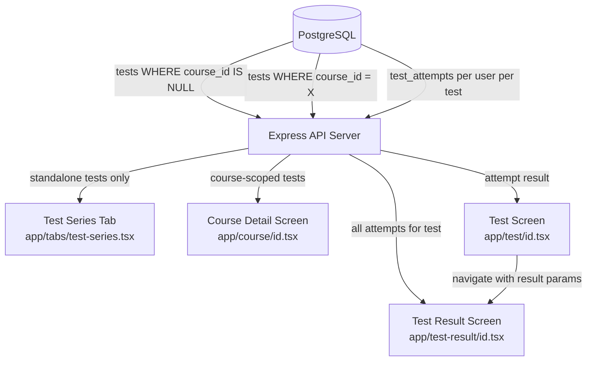
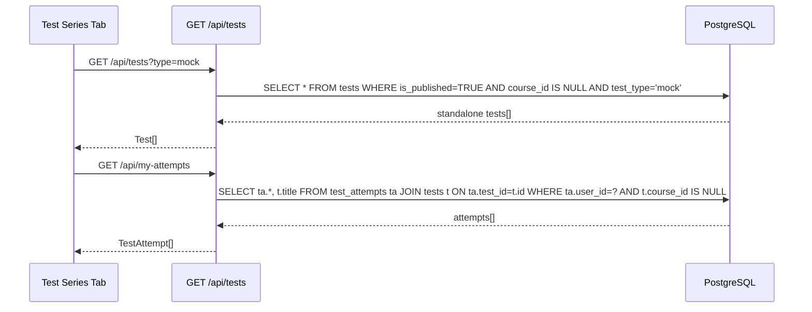
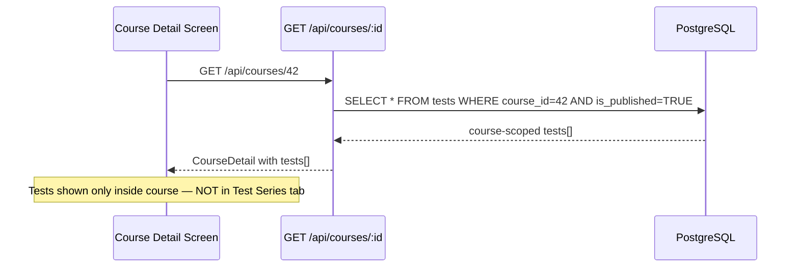
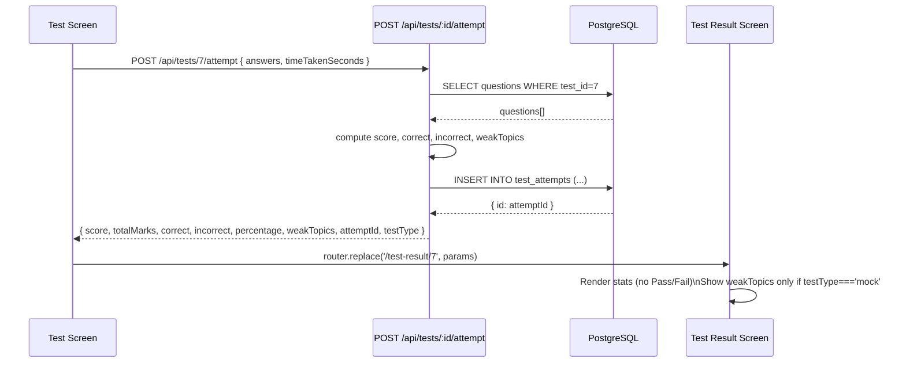
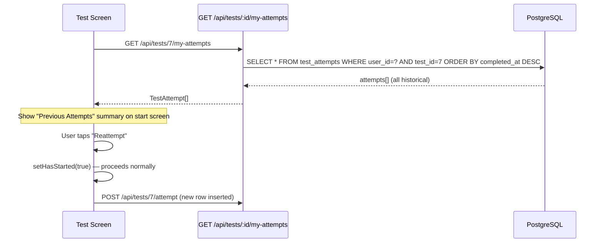

# Design Document: Test Visibility and Results

## Overview

This feature governs two distinct concerns: (1) where tests appear in the app (course-scoped vs. standalone Test Series section), and (2) how test results are displayed (removing Pass/Fail, showing richer stats, supporting multiple attempts per test). The changes span the backend API, the standalone Test Series tab, the test result screen, and the course detail screen.

---

## Architecture



---

## Components and Interfaces

### Component 1: Test Visibility Filter (Backend)

**Purpose**: Ensure `GET /api/tests` only returns tests with `course_id IS NULL` (standalone), and `GET /api/courses/:id` continues to return only course-linked tests.

**Interface**:
```typescript
// GET /api/tests — standalone tests only
// Query params: type? (practice | test | pyq | mock)
// Returns: Test[] where course_id IS NULL

// GET /api/courses/:id — course-scoped tests unchanged
// Returns: CourseDetail with tests[] where course_id = :id
```

**Responsibilities**:
- Add `AND course_id IS NULL` filter to `GET /api/tests` query
- No change needed to `GET /api/courses/:id/tests` — already filters by `course_id`

---

### Component 2: My Attempts Filter (Backend)

**Purpose**: `GET /api/my-attempts` should only return attempts for standalone tests (course_id IS NULL), so course-linked results don't bleed into the Test Series results section.

**Interface**:
```typescript
// GET /api/my-attempts — standalone test attempts only
// Returns: TestAttempt[] joined with tests WHERE t.course_id IS NULL

// GET /api/tests/:id/my-attempt — returns ALL attempts (not just latest)
// Returns: TestAttempt[] ordered by completed_at DESC (multiple rows)
```

**Responsibilities**:
- Filter `my-attempts` to exclude course-linked tests
- Change `my-attempt` endpoint to return all attempts (not `LIMIT 1`) to support reattempt history

---

### Component 3: Test Result Screen

**Purpose**: Display enriched result stats, remove Pass/Fail, show per-attempt history when reattempting.

**Interface**:
```typescript
interface ResultParams {
  id: string;           // test id
  score: string;
  totalMarks: string;
  correct: string;      // NEW
  incorrect: string;    // NEW
  totalAttempts: string; // NEW — total questions attempted
  percentage: string;
  weakTopics: string;   // comma-separated, only for mock tests
  attemptId: string;
  testType: string;     // NEW — to conditionally show weak topics
}
```

**Responsibilities**:
- Remove "Pass/Fail" status card and green/red header gradient tied to pass state
- Show: Total Score, Total Attempts (questions attempted), Correct, Incorrect, Percentage
- Show Weak Topics section only when `testType === "mock"`
- Show attempt history list when user has multiple attempts on the same test

---

### Component 4: Test Screen (Reattempt Support)

**Purpose**: Instead of redirecting to result on existing attempt, allow reattempt and show all past attempts on the result screen.

**Interface**:
```typescript
// Current: redirects to result if existingAttempt found
// New: shows "Reattempt" option alongside previous result summary
```

**Responsibilities**:
- On test start screen, if prior attempt exists: show last score summary + "Reattempt" button
- On submit: always create a new attempt row (current behavior already does this via INSERT)
- Pass `attemptNumber` or `totalAttempts` count to result screen

---

### Component 5: Test Series Tab (Frontend)

**Purpose**: Only show standalone tests and their results; exclude course-linked tests.

**Responsibilities**:
- `GET /api/tests` already filtered server-side — no frontend change needed for test list
- `GET /api/my-attempts` already filtered server-side — no frontend change needed for attempts
- Display each attempt separately in "Recent Attempts" (already maps over array)

---

## Data Models

### Existing: `tests` table

```typescript
interface Test {
  id: number;
  title: string;
  description: string;
  course_id: number | null;   // NULL = standalone; non-null = course-linked
  test_type: "practice" | "test" | "pyq" | "mock";
  duration_minutes: number;
  total_questions: number;
  total_marks: number;
  passing_marks: number;      // retained in DB, no longer shown in UI
  is_published: boolean;
  folder_name: string | null;
  created_at: number;
}
```

### Existing: `test_attempts` table

```typescript
interface TestAttempt {
  id: number;
  user_id: number;
  test_id: number;
  answers: Record<string, string>;  // JSON
  score: number;
  total_marks: number;
  percentage: string;
  time_taken_seconds: number;
  status: "completed";
  started_at: number;
  completed_at: number;
}
```

**New derived fields** (computed at query time, not stored):
```typescript
interface AttemptResult extends TestAttempt {
  correct: number;    // count of correct answers
  incorrect: number;  // count of wrong answers
  attempted: number;  // correct + incorrect (skipped not counted)
}
```

### Updated: Result Screen Params

```typescript
interface TestResultParams {
  id: string;
  score: string;
  totalMarks: string;
  correct: string;       // NEW
  incorrect: string;     // NEW
  totalAttempts: string; // NEW — questions attempted (not test reattempts)
  percentage: string;
  weakTopics: string;
  attemptId: string;
  testType: string;      // NEW
}
```

---

## Sequence Diagrams

### Flow 1: Standalone Test Series Tab Load



### Flow 2: Course-Linked Test (stays inside course)



### Flow 3: Test Submit → Result Screen



### Flow 4: Reattempt Flow



---

## Error Handling

### Error Scenario 1: No standalone tests exist

**Condition**: `GET /api/tests` returns empty array after `course_id IS NULL` filter  
**Response**: Frontend shows existing empty state ("No tests available")  
**Recovery**: No action needed — admin creates standalone tests via admin panel

### Error Scenario 2: Attempt submission fails

**Condition**: `POST /api/tests/:id/attempt` throws DB error  
**Response**: Alert shown to user ("Failed to submit test. Please try again.")  
**Recovery**: Timer is not cleared; user can retry submission

### Error Scenario 3: Multiple attempts — redirect loop

**Condition**: Old code redirected to result if `my-attempt` returned a row; with multiple attempts this could loop  
**Response**: Change `my-attempt` endpoint to `my-attempts` (plural) returning all rows; test screen shows prior attempts summary instead of auto-redirecting  
**Recovery**: User explicitly chooses to reattempt or view last result

---

## Testing Strategy

### Unit Testing Approach

- Test `GET /api/tests` returns only rows where `course_id IS NULL`
- Test `GET /api/my-attempts` excludes attempts for course-linked tests
- Test score computation: correct/incorrect counts match expected values given known answers
- Test `weakTopics` only populated for `test_type = 'mock'`

### Property-Based Testing Approach

**Property Test Library**: fast-check

- For any set of answers, `correct + incorrect + skipped === total_questions`
- For any score, `0 <= percentage <= 100`
- `course_id IS NULL` filter is idempotent — applying it twice returns same result

### Integration Testing Approach

- Create a course-linked test and a standalone test; verify `GET /api/tests` returns only the standalone one
- Submit two attempts for the same test; verify `GET /api/tests/:id/my-attempts` returns both rows
- Verify result screen params include `correct`, `incorrect`, `totalAttempts`, `testType`

---

## Performance Considerations

- `course_id IS NULL` filter uses an index if `course_id` is indexed; add index if not present: `CREATE INDEX IF NOT EXISTS idx_tests_course_id ON tests(course_id)`
- `my-attempts` query joins `test_attempts` and `tests` — already efficient with existing PKs
- Multiple attempts per test: no pagination needed at current scale; add `LIMIT 20` as safeguard

---

## Security Considerations

- All attempt endpoints require authenticated session (`req.session.user`)
- Users can only read their own attempts — all queries filter by `user_id = $1`
- `passing_marks` field retained in DB for potential future use but not exposed in result UI

---

## Dependencies

- No new packages required
- Existing: `@tanstack/react-query`, `expo-router`, `expo-haptics`, `expo-linear-gradient`
- DB: PostgreSQL with existing `tests` and `test_attempts` tables

---

## Correctness Properties

*A property is a characteristic or behavior that should hold true across all valid executions of a system — essentially, a formal statement about what the system should do. Properties serve as the bridge between human-readable specifications and machine-verifiable correctness guarantees.*

### Property 1: Standalone test filter

*For any* database state containing a mix of standalone tests (`course_id IS NULL`) and course-linked tests (`course_id IS NOT NULL`), the result of `GET /api/tests` should contain only tests where `course_id IS NULL`.

**Validates: Requirements 1.1, 1.2**

---

### Property 2: Course test isolation

*For any* course id, the tests returned by `GET /api/courses/:id` should all have `course_id` equal to that id — no standalone or other-course tests should appear.

**Validates: Requirements 2.1**

---

### Property 3: My-attempts standalone filter

*For any* user with a mix of attempts on standalone tests and course-linked tests, `GET /api/my-attempts` should return only attempts whose associated test has `course_id IS NULL`.

**Validates: Requirements 3.1**

---

### Property 4: Each submission creates a new attempt row

*For any* test and authenticated user, submitting an attempt via `POST /api/tests/:id/attempt` should increase the count of rows in `test_attempts` for that user and test by exactly 1.

**Validates: Requirements 4.3**

---

### Property 5: Attempt history ordering

*For any* test with multiple attempts by the same user, `GET /api/tests/:id/my-attempts` should return all attempts ordered by `completed_at` descending (most recent first).

**Validates: Requirements 4.4**

---

### Property 6: Attempted count invariant

*For any* submitted answer set and question set, `correct + incorrect + skipped` must equal `total_questions`, where `attempted = correct + incorrect`.

**Validates: Requirements 6.2, 6.6, 9.1**

---

### Property 7: Percentage bounds

*For any* submitted answer set, the computed `percentage` must satisfy `0 <= percentage <= 100`.

**Validates: Requirements 9.2**

---

### Property 8: Weak topics accuracy

*For any* mock test submission, the returned `weakTopics` list should contain exactly the distinct topics where the student answered at least one question incorrectly — no more, no fewer. When all answers are correct, `weakTopics` should be empty.

**Validates: Requirements 7.1**
